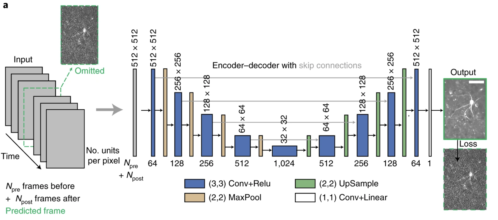
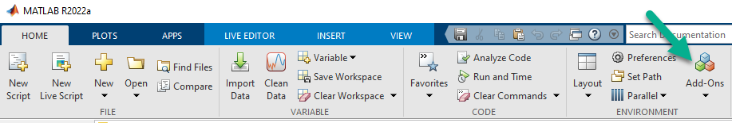

# DeepInterpolation with MATLAB
A MATLAB implementation of the DeepInterpolation principle

## About DeepInterpolation
DeepInterpolation is a [published](https://pubmed.ncbi.nlm.nih.gov/34650233) general-purpose algorithm created by the [Allen Institute](https://alleninstitute.org/) for removing noise that arrives independently from data frame to data frame. One known applicable domain is systems neuroscience, wherein neural activity measurement fidelity is commonly limited by independent noise sources (shot noise and/or thermal noise). 

See [Key Concepts](https://github.com/MATLAB-Community-Toolboxes-at-INCF/DeepInterpolation-MATLAB/edit/main/README.md#key-concepts) for further information. 

## Getting Started
Get started with inference examples which apply the DeepInterpolation principle to sample data using applicable pretrained models (i.e., trained with the same data type). You can readily view (on [File Exchange](https://www.mathworks.com/matlabcentral/fileexchange/?category%5B%5D=overview%2Fsciences1689.support%2Fneuroscie832.support%2Fcellular-837&sort=date_desc_updated)) or run (on [MATLAB Online](https://www.mathworks.com/products/matlab-online.html)) each example:

| Data Type | Pretrained Model|  Sample Data  | View  :eyes: | Run   ▶️
|  :--- | :---: | :---: | --- | --- | 
|🔬"Ophys"  (optical physiology2)| [🤖](https://github.com/MATLAB-Community-Toolboxes-at-INCF/DeepInterpolation-MATLAB/blob/main/pretrainedModels/pretrained.json)  (AWS, 120 MB) | [💾](sampleData/ophys_tiny_761605196.tif)   |  | 
|⚡"Ephys" (electrophysiology1)| [:robot:](https://github.com/MATLAB-Community-Toolboxes-at-INCF/DeepInterpolation-MATLAB/blob/main/pretrainedModels/pretrained.json)  | [💾](sampleData/ephys_tiny_continuous.dat2) |  | 

1 via Neuropixels neural probes 2 via two-photon (2P) calcium imaging

First-time users on MATLAB Online will be prompted to install the [Deep Learning Toolbox Converter for TensorFlow Models](https://nl.mathworks.com/matlabcentral/fileexchange/64649-deep-learning-toolbox-converter-for-tensorflow-models) support package. Please follow the prompted link to complete the installation and re-run the example. See [Installation](https://github.com/MATLAB-Community-Toolboxes-at-INCF/DeepInterpolation-MATLAB/edit/vijayiyer05-patch-1/README.md#installation) for further guidance to install DeepInterpolation with MATLAB on your local or cloud compute environment. 

## Going Further

### Train DeepInterpolation models 
Expected use cases involve training on a user's representative or actual dataset. The following examples illustrate the transfer learning workflow for (re)training DeepInterpolation pretrained models along with subsequent inference. Notably the DeepInterpolation principle **does not require separate ground truth data**; thus training and inference can be run using the same dataset. 

| Data Type  | Pretrained Model |  Sample Data | View :eyes:| Run ▶️
|---|---|---|---|---|
| 🔬"Ophys" (optical physiology1)| [TODO](sample_data/pretrainedNetwork.mat) | [sample data](sampleData/ophys_tiny_761605196.tif) |  | 
| ⚡ Ephys" (electrophysiology2) | ["Ephys-Neuropixels_Phase_3a_1050"](pretrainedModels/pretrained.json) | [sample data](sampleData/ephys_tiny_continuous.dat2) |  | 

1 via two-photon (2P) calcium imaging 2 via Neuropixels neural probes

### Work with Public Datasets
Expected use cases will involve larger data sizes, for which remote data locations and/or big data handling become important considerations. The following examples utilize larger datasets from cloud-hosted public scientific data archives to illustrate these data acccess & handling workflows.

| Data Type  | Pretrained Model |  Public Data Archive | View :eyes: | Run ▶️
|---|---|---|---|---|
|🔬"Ophys" (optical physiology) | [model](pretrainedModels/pretrained.json) | [Allen Brain Observatory](http://allen-brain-observatory.s3.amazonaws.com/visual-coding-2p/ophys_movies/ophys_experiment_496908818.h5) (55.6 GB) |  | (\*) |
|🧠 fMRI (functional magnetic resonance imaging) | [TODO](pretrainedModels/pretrained.json) (AWS)| [Open Neuro](https://openneuro.org/datasets/ds001246/versions/1.2.1) (18.3 GB)|  | 

(\*) This data-intensive example is recommended for use on a local machine, not for MATLAB online.

## Key Concepts

DeepInterpolation uses deep learning to predict a data frame from the contents of several preceeding and succeeding frames. The resulting prediction is free of independent noise such as shot noise (imaging) or thermal noise (electrophysiology). 

If the signal is well predicted by these preeceding and succeeding frames, as in 2-photon imaging and multi-channel recording, then DeepInterpolation does an excellent job of increasing signal-to-noise ratio. In systems neuroscience, this allows more cells to be characterized with better certainty about their activity. 

<!--
The principle behind DeepInterpolation is illustrated in the following figure from [Lecoq et al. 2021]((https://pubmed.ncbi.nlm.nih.gov/34650233)) in _Nature Methods_. 

. 
--> 

During training, the network is modified so that it produces better and better representations of the predicted frames over several datasets. During inference, the network produces predicted frames that are used in place of the original data. 

DeepInterpolation works well in situations where the signal in the data is well predicted by the information in the preceeding and succeeding frames. In these cases, the inferred data contains a good reconstruction of the underlying signal while the noise that occurs independently on each frame is greatly reduced, because the noise is not predicted on average.

### Installation
To install the DeepInterpolation-MATLAB persistently on a local machine or cloud instance, the [**Add-on Explorer**](https://www.mathworks.com/products/matlab/add-on-explorer.html) is recommended: 
1. Launch the Add-on Explorer 
2. Search for "DeepInterpolation"
3. Press the "Add" button.

### About DeepInterpolation with MATLAB 
DeepInterpolation with MATLAB is a public repository. Contributions can be made in the form of [adding issues](https://github.com/MATLAB-Community-Toolboxes-at-INCF/DeepInterpolation-MATLAB/issues) or submitting pull requests.

#### Uses other open source resources
We use [progressbar](https://www.mathworks.com/matlabcentral/fileexchange/6922-progressbar) and mimic some functions from [Brain Observatory Toolbox](https://www.mathworks.com/matlabcentral/fileexchange/90900-brain-observatory-toolbox).

#### Other implementations of DeepInterpolation
- [Python](https://github.com/AllenInstitute/deepinterpolation)

